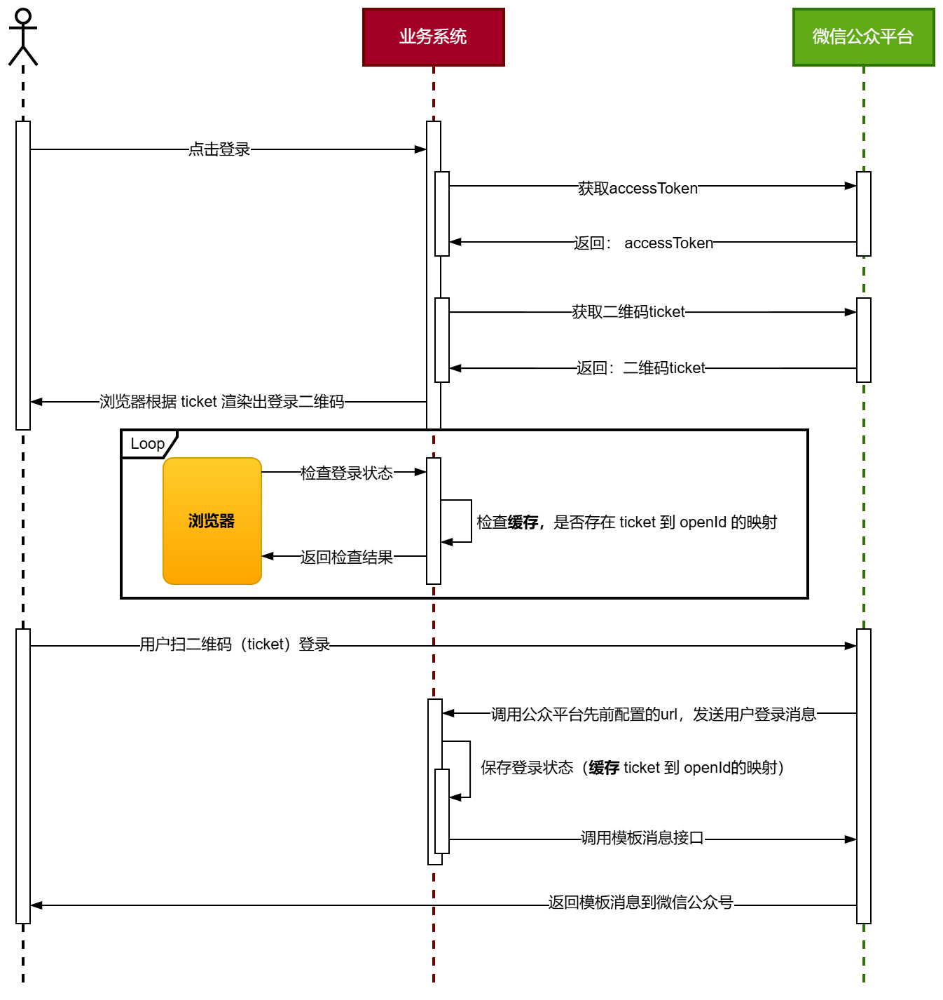

# 项目介绍

- 项目基于[微信公众号测试平台] + [支付宝开放平台的沙箱测试环境]，以实际生产中的支付流程，即**扫码登录**、**商品下单**、**支付对接**、**掉单补偿**进行设计和实现。
  > 其中微信公众号用于登录、支付宝开放平台用于支付。

# 目录结构描述

    E:.
    ├─ docs/                   # 项目文档
    │  ├─ dev-ops/            
    │  ├─ image/               # 图像资源文件
    │  ├─ mysql/sql/           # 与MySQL数据库相关的SQL脚本
    │  ├─ natapp/              # ⭐内网穿透工具相关配置和文档
    │  └─ nginx/html/images/   # Nginx配置和相关的静态资源文件
    ├─ quick-pay-shop-common/   # 🎯公共模块，包含通用的工具类与配置
    │  └─ src/main/java/cn/learn/common/
    │      ├─ constants/       # 常量
    │      ├─ exception/       # 自定义异常类
    │      ├─ response/        # 标准的响应格式
    │      └─ weixin/          # 微信公众平台消息实体类、签名验证处理类、XML解析类
    ├─ quick-pay-shop-controller/  # 🎯控制层模块，处理用户请求
    │  └─ src/main/java/cn/learn/controller/
    │      ├─ config/          # 配置类
    │      ├─ controller/dto/  # 数据传输对象，用于与前端交互
    │      ├─ job/             # 定时任务
    │      ├─ listener/        # 事件监听器
    │      └─ resources/mybatis/
    │          ├─ config/      
    │          └─ mapper/      # MyBatis的Mapper接口和XML文件
    ├─ quick-pay-shop-dao/      # 🎯数据访问层，封装数据库操作
    │  └─ src/main/java/cn/learn/dao/
    ├─ quick-pay-shop-domain/   # 🎯领域层，定义业务领域对象
    │  └─ src/main/java/cn/learn/domain/
    │      ├─ po/              # 持久化对象
    │      ├─ req/             # 请求对象
    │      ├─ res/             # 响应对象
    │      └─ vo/              # 值对象
    └─ quick-pay-shop-service/  # 🎯服务层，封装业务逻辑
        └─ src/main/java/cn/learn/service/
            ├─ impl/           # 服务实现类
            ├─ rpc/            # 远程调用相关类
            └─ weixin/         # 微信公众平台提供的API调用服务
    

# 使用说明

- 项目启动时，需要先开启**内网穿透服务**，再启动项目，否则微信公众平台无法对接。

- [微信公众平台](https://mp.weixin.qq.com/debug/cgi-bin/sandboxinfo?action=showinfo&t=sandbox/index)：登录配置服务器url及token。
- [支付宝开放平台-沙箱](https://open.alipay.com/develop/sandbox/app)：登录查看测试用户账号及支付密码。

# 实现细节

## 组件使用

Guava 缓存：1. 将accessToken缓存到本地。2. 将用户登录状态缓存到本地（登录二维码ticket 和 openId）。

Guava 事件总线：相当于一个**本地的消息队列**，通过发布和订阅事件来解耦商品下单和商品发货模块。

Retrofit：一个HTTP 客户端库，将 HTTP 请求封装为方法调用，简化网络通信代码，提高开发效率。

## 模块一：微信公众号登录

> 1. **对接细节**：对接微信公众号需要提供同名但不同请求方式 **get、post**的两个接口。其中get请求用于验证签名，post 请求用于验签后，接收来自于用户在公众号发送的消息。
> 2. **内网穿透**：项目开发中，通常使用本地（localhost）进行接口测试，但是与微信公众平台进行对接时，微信公众平台无法直接访问本地IP。为解决此问题，需要使用内网穿透，将微信公众平台对本地IP的请求转换为对内网穿透服务端公网IP的访问，再由内网穿透服务完成请求的转发。

## 模块二：商品下单&支付付款

- 除了关注整个流程外，还应关注一些掉单处理的设计。

# 参考：

[微信公众号开发基本流程-CSDN博客](https://blog.csdn.net/Abysscarry/article/details/89071469)